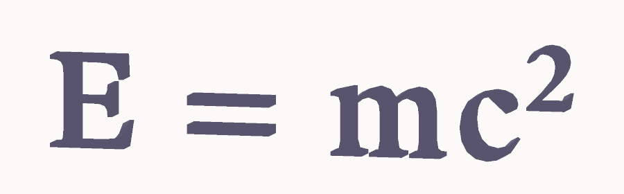
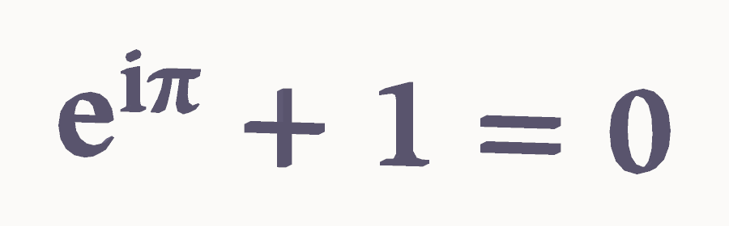
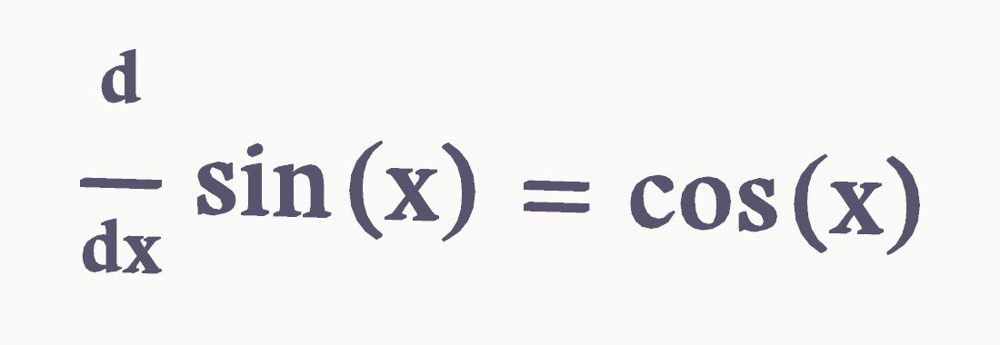
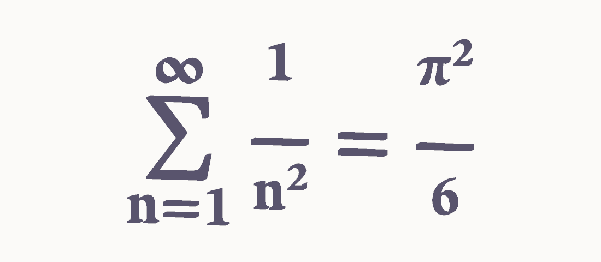
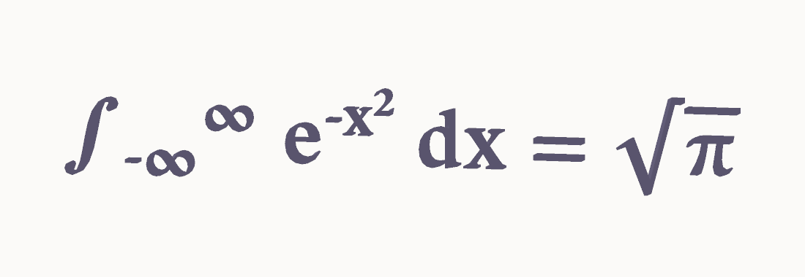
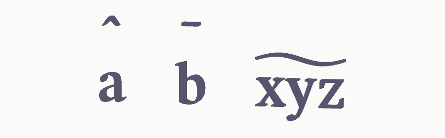

# LaTeX++ - 

LaTeX++ parses a LaTeX math expression, looks up each glyph's outline in a
loaded OpenType font (TTF / OTF), and emits an extruded triangle mesh ready
for any renderer. There is no graphics-API dependency: the library returns
flat vertex / index buffers, you upload them however you like.

## Gallery

| | |
|:---:|:---:|
|  |  |
|  |  |
|  |  |

> Each tile above is a `MeshData` returned by `generateLatexMesh`, software-
> rasterized with a tiny built-in renderer ([samples/render_samples.cpp](samples/render_samples.cpp)).
> A real consumer would upload the same vertices/indices to its own GPU
> renderer. To regenerate after a code change:
>
> ```sh
> cmake -S . -B build \
>     -DLATEX3D_BUILD_SAMPLES=ON \
>     -DLATEX3D_SAMPLES_FONT=/path/to/math.otf
> cmake --build build --target latex3d_samples
> ```
>
> Any OpenType font with a MATH table works — Fira Math, STIX Two Math,
> Latin Modern Math. Sources are listed in
> [samples/CMakeLists.txt](samples/CMakeLists.txt). The `latex3d_samples`
> target only appears when `LATEX3D_SAMPLES_FONT` is set, so the configure
> step won't fail on a fresh clone.

## Features

It supports a useful subset of math-mode LaTeX:

- Greek letters: `\alpha`–`\Omega`
- Operators: `\sum`, `\int`, `\cdot`, `\leq`, `\geq`, `\neq`, …
- Fractions: `\frac{a}{b}`
- Sub/superscripts: `x^2`, `x_i`, `x^{ab}`
- Accents: `\hat{x}`, `\bar{x}`, `\widetilde{xyz}`, …
- Over/underline rules
- `\overbrace` / `\underbrace`
- Mixed text/math runs

When the loaded font carries an OpenType MATH table (Fira Math, STIX Two
Math, Latin Modern Math, …) the layouter routes typographic constants
(axis height, fraction-rule thickness, super/subscript shift, top-accent
attachment) through it, so output matches what the type designer intended.
For fonts without a MATH table, sensible LaTeX-Computer-Modern-ish defaults
are used.

## Quick start

```cpp
#include <latex3d/latex3d.h>

// Once at startup
latex3d::loadFont("FiraMath-Regular.otf", latex3d::FontSlot::Latex);

// Per LaTeX expression
latex3d::LatexOptions opt;
opt.charHeight = 1.0f;          // em-height in your world units
opt.depth = 0.18f;              // Z extrusion (ignored when mode==Panel)
opt.color = glm::vec3(1.0f);
latex3d::MeshData mesh = latex3d::generateLatexMesh("E = mc^2", opt);

// Upload mesh.vertices and mesh.indices to your renderer.
// Vertex layout: { float position[3]; float color[3]; float normal[3]; }
// Triangles are CCW (front face).
```

## Building

### Standalone

```sh
cmake -S . -B build
cmake --build build
ctest --test-dir build           # runs the layouter unit tests
```

Dependencies:

- **FreeType** ≥ 2.4 — required at runtime; resolved via `find_package(Freetype)`.
- **glm** — header-only; tried via `find_package(glm)`, fetched via
  `FetchContent` (g-truc/glm 1.0.1) if no CMake config is installed.
- **earcut.hpp** — header-only polygon triangulator; tried via
  `find_package(earcut_hpp)`, fetched via `FetchContent` (mapbox 2.2.4) if
  not found.

Only FreeType is genuinely required to be present on the system; the
other two are fetched on demand, so a fresh clone builds out of the box.

### As a sub-project

Drop the directory into your tree and add it before any consumer:

```cmake
add_subdirectory(third_party/latex3d)
target_link_libraries(my_app PRIVATE latex3d::latex3d)
```

If your parent project already provides `freetype`, `glm`, `earcut_hpp` and
`Catch2::Catch2WithMain` as targets (e.g. via FetchContent), `latex3d` will
detect and reuse them rather than re-fetching.

## Public headers

| Header | Purpose |
|--------|---------|
| `latex3d/latex3d.h` | Umbrella — pulls in everything below |
| `latex3d/mesh.h` | Renderer-agnostic `Vertex` POD + `MeshData` |
| `latex3d/text3d.h` | Font registry, glyph extraction, plain 3D text mesh, low-level extrusion primitives |
| `latex3d/layouter.h` | Font-agnostic LaTeX → em-space op stream (no FreeType dep) |
| `latex3d/generator.h` | High-level LaTeX → `MeshData` using the loaded font |
| `latex3d/math_table.h` | OpenType MATH-table parser (parsed automatically when a font is loaded) |
| `latex3d/log.h` | Optional log callback for diagnostics |

## Diagnostics

`latex3d` is silent by default. To capture diagnostic messages (failed font
loads, MATH-table parse hits, etc.) install a callback at startup:

```cpp
latex3d::setLogCallback(
    [](latex3d::LogLevel lvl, const char *msg, void *) {
        std::fprintf(stderr, "%s\n", msg);
    },
    nullptr);
```

If `loadFont` returns `false` and you haven't installed a callback, the
reason will not be visible — wire one up first while you're integrating.

## Design notes

### Renderer-agnostic vertex POD

The public `latex3d::Vertex` is `{ float position[3]; float color[3]; float normal[3]; }`
— deliberately not `glm::vec3` so consumers don't have to drag glm through
their build. Internally the geometry pipeline uses `glm` for math (cross
products, normal generation) and converts at the emit boundary. The
triangle winding is CCW; flip indices on import for a left-handed renderer.

### Layouter is independent

`latex3d/layouter.h` only depends on the standard library and a pluggable
`latex3d::FontMetrics` interface. You can use it with no font at all (e.g.
to sanity-check input from a level editor), or with a custom non-FreeType
metrics source. The unit tests do exactly this with a fake monospace
metrics provider — see `tests/test_layouter.cpp`.

### Roadmap

- Stretchy delimiters (`\left( … \right)`) — needs OpenType
  `MathVariants` + `MathGlyphAssembly` parsing and a layout-twice pass.
- `\begin{matrix} … \end{matrix}` environments.
- Splitting `math_table.h` into a POD-only public surface and a
  FreeType-touching internal implementation, so embedders who only want
  the constants don't transitively pull `FT_Face` forward-decls.

## License

MIT. See `LICENSE`.
